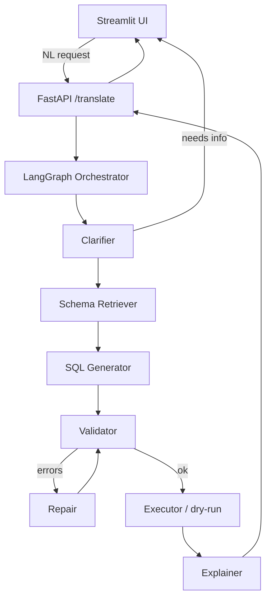

# Multi-Agent System: Human Request → Databricks Query

NL request → validated, executable Databricks SQL, with self-correction.

## 1. High-level flow



## 2. Agents & roles

| Agent | Responsibility | Model |
|-------|----------------|-------|
| **Orchestrator** | LangGraph state machine; routing, loop control, max-retries | — (graph logic) |
| **Clarifier** | Parse intent, detect ambiguity, ask follow-up questions | Haiku |
| **Schema Retriever** | RAG over Unity Catalog / `information_schema`; pick relevant tables & columns | Haiku + tool |
| **SQL Generator** | Produce Databricks (Spark) SQL from intent + schema context | Sonnet |
| **Validator** | Static + semantic checks (see §5) | Haiku + tools |
| **Repair** | Fix query using Validator feedback; loop back | Sonnet |
| **Executor** | Dry-run `EXPLAIN` / `LIMIT` run on SQL Warehouse (optional) | — (tool) |
| **Explainer** | Plain-language summary of query & results | Haiku |

Model mix: cheap roles (parse/retrieve/validate/explain) → Haiku; reasoning-heavy roles (generate/repair) → Sonnet.

## 3. LangGraph state

Shared `Pydantic` state object passed between nodes:

```
GraphState:
  user_request: str
  clarifications: list[QA]
  schema_context: list[TableInfo]
  sql: str | None
  validation: ValidationResult | None
  attempts: int
  result: QueryResult | None
  explanation: str | None
  status: Literal["clarify","running","done","failed"]
```

Conditional edges: `Validator → Repair` while `attempts < N` and errors exist; else `→ Executor`. `Clarifier` can interrupt the graph to request user input (LangGraph `interrupt`).

## 4. Backend (FastAPI · Pydantic)

- `POST /translate` — start run, returns query + status (or clarifying questions).
- `POST /clarify` — resume interrupted graph with user answers.
- `POST /execute` — run approved SQL.
- `GET /health`.
- All request/response bodies typed with Pydantic; LangGraph state checkpointed (e.g. in-memory / SQLite saver) so sessions resume.

## 5. Validation strategy (Validator agent)

1. **Syntax** — parse with `sqlglot` (Databricks dialect).
2. **Schema** — every table/column exists in retrieved schema.
3. **Dialect/safety** — block DDL/DML if read-only mode; enforce `LIMIT`.
4. **Dry-run** — `EXPLAIN` against SQL Warehouse to catch planner errors.
5. Returns structured `ValidationResult(ok, errors[])` → feeds Repair loop.

## 6. LLM layer

- Provider abstraction: OpenRouter **or** Anthropic API direct.
- Per-role model config (Haiku/Sonnet) in one settings file; swappable via env.
- Each agent = prompt template + structured (Pydantic) output parsing.

## 7. UI (Streamlit — required)

- Input box for NL request; chat-style clarification turns.
- Show generated SQL (syntax-highlighted), validation status, EXPLAIN/result preview.
- Buttons: Approve & Run / Edit / Regenerate.
- Calls FastAPI endpoints; displays per-agent trace for transparency.

## 8. Tooling (Databricks)

- Databricks SDK / SQL connector for `information_schema`, `EXPLAIN`, query execution against a SQL Warehouse.
- Schema cache + embedding index for retrieval.

## 9. Suggested project structure

```
app/
  agents/        clarifier.py generator.py validator.py repair.py explainer.py schema.py
  graph/         state.py build_graph.py
  llm/           provider.py models.py prompts/
  tools/         databricks.py sqlglot_check.py
  api/           main.py routes.py schemas.py
  ui/            streamlit_app.py
  config.py
```

## 10. Tech stack

Python 3.11+ · FastAPI · Pydantic · LangGraph · OpenRouter/Anthropic (Haiku+Sonnet mix) · Streamlit · sqlglot · Databricks SDK.
